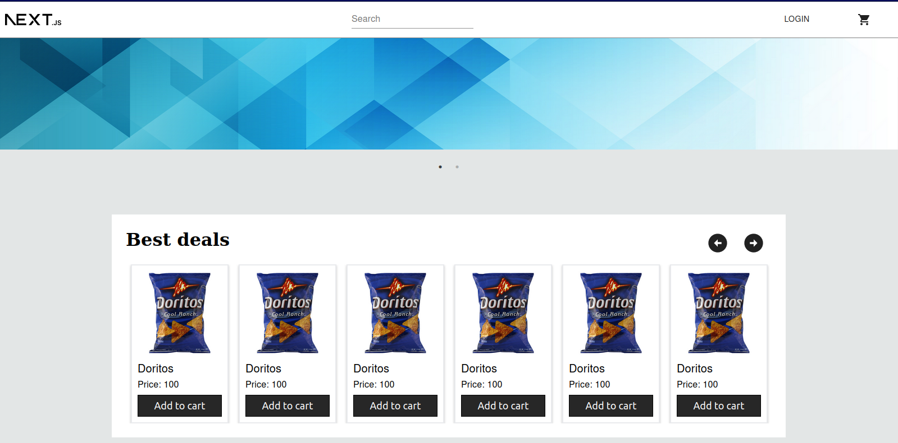
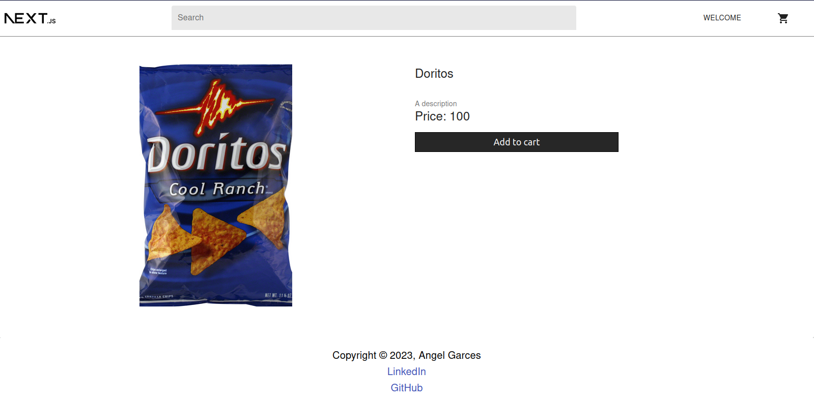
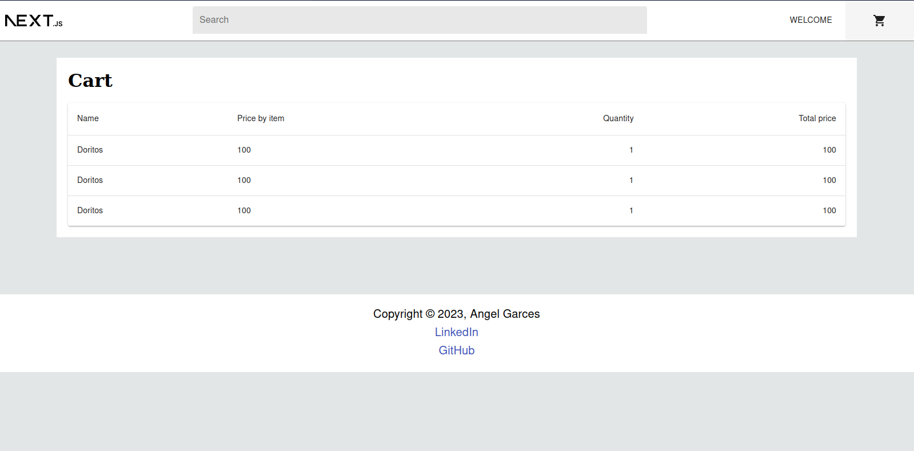
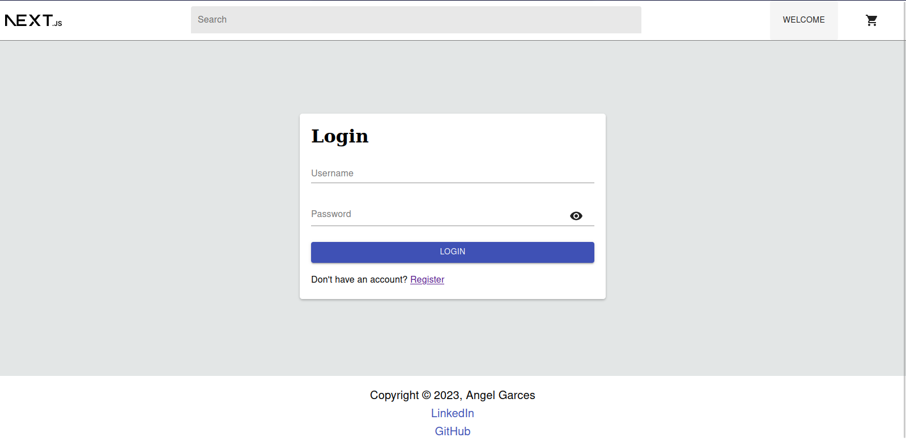
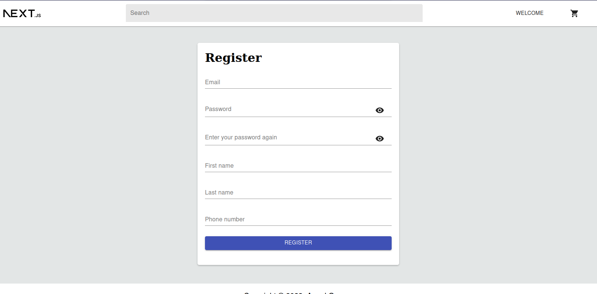
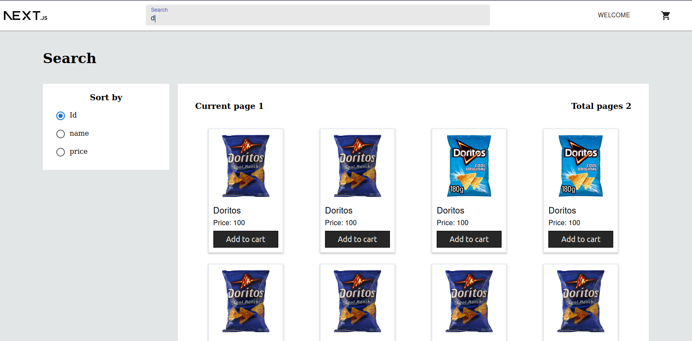
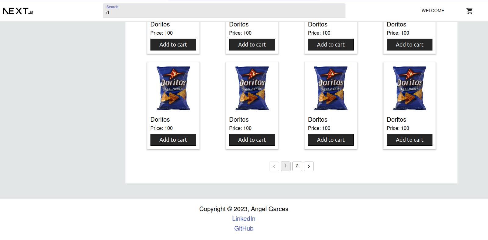

# Front-end of a simple e-commerce website

This is the front-end of an e-commerce web application made in NEXT.js the back-end can be found here [Back-end in spring boot (Java)](https://github.com/AngelVzla99/backend-e-commerce-spring)

# Technology

- Next.js - for server side rendering
- Tailwind - For better styles
- Material UI - Pre-defined components with animation
- ESLint - Statically analysis the code
- Axios - To make http request to the back-end application

# Run and test the server locally

## Running the server

Requires npm installed

```sh
$ npm install
$ npm run dev
```

## Images of the pages

In this section we will see al the pages available in the project and a simple explanation of each one of them

### Main



### Product detail



### Items in the cart



### Login and register




### Search view



